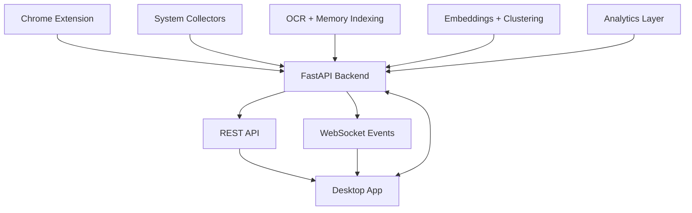

# KnemOS


KnemOS is a local-first productivity system that adds an AI-powered cognitive layer to your desktop. It brings together a Tauri desktop application, a FastAPI backend, and a Chrome extension to organize active work into semantic workspaces, index screen history, and surface productivity insights.

```text
██╗  ██╗███╗   ██╗███████╗███╗   ███╗ ██████╗ ███████╗
██║ ██╔╝████╗  ██║██╔════╝████╗ ████║██╔═══██╗██╔════╝
█████╔╝ ██╔██╗ ██║█████╗  ██╔████╔██║██║   ██║███████╗
██╔═██╗ ██║╚██╗██║██╔══╝  ██║╚██╔╝██║██║   ██║╚════██║
██║  ██╗██║ ╚████║███████╗██║ ╚═╝ ██║╚██████╔╝███████║
╚═╝  ╚═╝╚═╝  ╚═══╝╚══════╝╚═╝     ╚═╝ ╚═════╝ ╚══════╝

AI-Powered Semantic Workspace Operating System
```


## Table of Contents

- [Vision](#vision)
- [The Problem](#the-problem)
- [Repository Overview](#repository-overview)
- [Product Ecosystem](#product-ecosystem)
- [What KnemOS Does](#what-knemos-does)
- [AI Pipeline](#ai-pipeline)
- [Current Architecture](#current-architecture)
- [Technology Stack](#technology-stack)
- [Project Structure](#project-structure)
- [Checked-In Backend Capabilities](#checked-in-backend-capabilities)
- [Desktop App Notes](#desktop-app-notes)
- [Extension Notes](#extension-notes)
- [Why Local-First Matters](#why-local-first-matters)
- [Quick Start](#quick-start)
- [Recommended Startup Order](#recommended-startup-order)
- [Environment Notes](#environment-notes)
- [Development Status](#development-status)
- [Strengths Of The Project](#strengths-of-the-project)
- [Known Setup Complexity](#known-setup-complexity)
- [Suggested Documentation Map](#suggested-documentation-map)
- [Roadmap Themes](#roadmap-themes)
- [Contribution Notes](#contribution-notes)
- [License](#license)
- [Summary](#summary)

## Vision

Traditional operating systems organize work around files, folders, and app windows. Modern knowledge work happens across browser tabs, terminal sessions, editors, chats, dashboards, and documents at the same time. KnemOS is designed to sit between the user and that fragmented environment, then:

- understand what is currently open
- group related resources into meaningful workspaces
- remember what was on screen earlier
- make those memories searchable with natural language
- help reduce distraction and context-switching overhead

The project is currently Windows-first and local-first.

## The Problem

KnemOS starts from a simple observation: knowledge work is not failing because people cannot store files, it is failing because modern work is cognitively fragmented.

Typical symptoms:

- too many tabs staying open for too long
- project context split across browser, IDE, terminal, and chat
- useful on-screen information disappearing once a tab or window is closed
- constant micro-switching between workspaces with no semantic memory

This project tries to shift operating-system thinking away from files and folders toward context, intent, and continuity.

## Repository Overview

This repository contains three main product surfaces:

| Area | Path | Purpose |
|---|---|---|
| Desktop application | `DESKTOP_APP/` | Main user interface built with Tauri, React, and TypeScript |
| Local AI backend | `WEBSITE/BACKEND/` | FastAPI service that handles clustering, memory indexing, analytics, scheduling, and WebSocket updates |
| Chrome extension | `EXTENSION/` | Browser integration layer that sends tab context to the local backend |

There are also supporting planning documents at the repo root:

- `features.md`
- `issues.md`

## Product Ecosystem

KnemOS is easier to understand when viewed as one system made of three coordinated layers:

```text
                    KnemOS Ecosystem

    Website / Docs        Desktop App          Browser Layer
    Product surface       Core interface       Chrome extension
    Project identity      Tauri + React        Tab intelligence
                          Local runtime        Context ingestion

                   Shared local backend engine
                  FastAPI + clustering + memory
```

The website side is only partially represented in this checkout, while the desktop app, backend, and extension are much more concrete.

## What KnemOS Does

### 1. Semantic workspace clustering

KnemOS collects signals from your active environment, such as:

- running processes
- window titles
- browser tabs
- local file activity

It then converts the available text metadata into embeddings and groups related resources into named workspaces.

Example outcome:

- development tabs, editor windows, and terminal sessions become one workspace
- research articles and notes become another workspace
- communication tools get separated from focused project work

Illustrative before/after:

```text
BEFORE                          AFTER

GitHub tab                      VendorBridge Dev
FastAPI docs                    GitHub + FastAPI + auth.py + Terminal
auth.py in editor
Terminal session                Research Workspace
Stack Overflow                  Docs + notes + article tabs

Slack                           Communication
Gmail                           Slack + Gmail + notifications
Calendar
```

### 2. Memory Lane

KnemOS periodically captures screenshots, extracts text with OCR, and stores searchable context in a vector database. This allows users to ask for something like:

`that auth bug I was looking at this morning`

and retrieve relevant historical context from past workspace states.

Conceptually, this turns ephemeral screen state into a searchable historical layer instead of losing it the moment a window changes.

### 3. Deep Work support

The desktop app includes focus-oriented UI surfaces and automation hooks intended to reduce interference from off-context tools and background clutter.

### 4. RAM and system awareness

The platform is designed to reason about active and inactive workspaces, with the long-term goal of hibernation, recovery metrics, and reduced overhead from stale context.

### 5. Productivity analytics

The backend includes Wolfram-based analytics plumbing for features such as:

- focus scoring
- workflow heatmaps
- context-switch analysis
- next-workspace prediction

### 6. Context export potential

The broader product direction also supports exporting workspace context into structured, reusable project summaries. That is a valuable direction for handoff notes, session recovery, and AI-assisted continuity.

## AI Pipeline

The repository points toward a multi-stage local pipeline:

```text
Step 1: Data Collection
  psutil + pywin32 + watchdog + mss + Chrome extension
  -> system state, browser state, file events, screenshots

Step 2: Text And Embeddings
  OCR text + workspace metadata
  -> semantic vectors

Step 3: Clustering
  HDBSCAN-style grouping
  -> related resources become workspaces

Step 4: Naming And Reasoning
  local LLM flow via Ollama / Qwen-family models
  -> human-readable workspace names

Step 5: Memory Indexing
  screenshots + OCR + vector storage
  -> searchable historical recall

Step 6: Analytics
  activity patterns + Wolfram-based analysis
  -> focus metrics and behavioral insight
```

That pipeline is one of the most compelling parts of the project because it connects raw desktop activity to semantic understanding instead of just collecting logs.

## Current Architecture

At a high level, the system looks like this:

1. The Chrome extension sends browser tab metadata to the local backend.
2. The backend collects system and workspace context, then runs indexing, clustering, and analytics workflows.
3. The desktop app connects to the backend over REST and WebSocket for real-time UI updates.

Core local endpoint:

- HTTP API: `http://127.0.0.1:8765`
- WebSocket: `ws://127.0.0.1:8765/ws`

### Architecture diagram



### Conceptual layer map

```text
Input Layer
- browser tabs
- system processes
- window titles
- screenshots
- file activity

Intelligence Layer
- embeddings
- clustering
- workspace naming
- memory indexing
- analytics

Experience Layer
- desktop dashboard
- workspace cards
- memory search
- analytics panels
- deep work overlay
```

## Technology Stack

### Desktop application

- Tauri v2
- React
- TypeScript
- Vite
- Tailwind CSS
- Zustand
- TanStack Query
- Framer Motion

### Backend

- FastAPI
- Uvicorn
- APScheduler
- WebSockets
- ChromaDB
- pytesseract
- Pillow
- mss
- psutil
- pywin32
- watchdog
- sentence-transformers ecosystem dependencies
- HDBSCAN
- scikit-learn
- NumPy
- Wolfram Client

### Browser integration

- Chrome Extension Manifest V3

### AI / ML components referenced in the project

- Ollama-hosted local models
- Qwen-based naming / reasoning flow
- embedding-based semantic clustering

### Model strategy

The earlier project material referenced two broad model tiers:

| Variant | Resource profile | Intended role |
|---|---|---|
| Larger local model | Standard desktop / laptop | richer workspace naming and reasoning |
| Smaller local model | lower-memory devices | lighter naming and reduced overhead |

That is a smart product direction because it lets KnemOS scale down for weaker machines instead of assuming every user has the same hardware budget.

### Why this stack makes sense

The stack is opinionated in a good way:

- Tauri keeps the desktop shell lighter than a traditional Electron-heavy approach
- FastAPI is a strong fit for local orchestration, background tasks, and API composition
- Manifest V3 keeps browser ingestion simple and close to the Chrome runtime
- local OCR and vector search make the memory feature materially useful instead of purely cosmetic

## Project Structure

```text
KnemOS/
|-- README.md
|-- features.md
|-- issues.md
|-- DESKTOP_APP/
|   |-- package.json
|   |-- src/
|   |-- src-tauri/
|   `-- README.md
|-- EXTENSION/
|   |-- manifest.json
|   |-- background.js
|   |-- popup/
|   `-- README.md
`-- WEBSITE/
    `-- BACKEND/
        |-- main.py
        |-- routers/
        |-- services/
        |-- models/
        |-- scheduler.py
        `-- requirements.txt
```

## Checked-In Backend Capabilities

Based on the current codebase, the backend exposes router groups for:

- `workspace`
- `memory`
- `analytics`
- `system`
- `chat`

It also starts a background scheduler during application startup and manages live WebSocket client connections for UI updates.

## Desktop App Notes

The desktop app is the primary user-facing interface. The checked-in app uses:

- `React 19.1.0`
- `@tauri-apps/api` v2
- `zustand`
- `@tanstack/react-query`
- `framer-motion`

The Tauri window configuration currently targets a dark themed, frameless desktop window with a default size of `1300x840`.

The frontend codebase also already has meaningful structure around:

- layout components
- workspace components
- memory components
- analytics components
- system overlays
- Zustand stores and query hooks

## Extension Notes

The Chrome extension is the browser intelligence layer for KnemOS. In the current repository state it:

- uses Manifest V3
- requests `tabs`, `storage`, and `alarms` permissions
- sends data to `http://127.0.0.1:8765/*`
- includes a popup UI and background service worker

Without the extension, the local backend has much less visibility into browser context.

That makes the extension strategically important, even though it is the smallest codebase surface in the repo.

## Why Local-First Matters

KnemOS is built around the idea that workspace understanding should not require sending sensitive user context to a remote service by default. The repository and docs consistently point toward a local loop where:

- processing runs on the user's machine
- browser state is posted to `127.0.0.1`
- the desktop app talks to the same local backend
- memory indexing stays close to the source context

That local-first direction is one of the most important product qualities in the project.

## Privacy Posture

For a product like this, privacy is not a secondary feature. It is part of the core value proposition. A system that reads tabs, screenshots, and windows has to earn trust, and local processing is the strongest foundation for that trust.

The current repo direction suggests these principles:

- keep sensitive context on the user's machine
- use localhost communication between components
- minimize external dependencies in the active runtime path
- isolate browser collection to explicit extension permissions
- make the backend the single local coordination point

## Quick Metrics And Value Signals

Even without treating them as formal benchmarks, the project narrative is built around a few meaningful value signals:

| Signal | Why it matters |
|---|---|
| fewer manually managed tabs | lowers cognitive overhead |
| searchable past screen state | reduces time lost re-finding context |
| grouped workspaces | improves session continuity |
| lighter desktop shell | better for always-on usage |
| focus analytics | helps users see work patterns, not just feel them |

## Quick Start

The repo does not currently provide a single top-level bootstrap script, so setup is done per component.

### 1. Backend

Prerequisites:

- Python 3.11 or newer recommended
- Tesseract OCR installed and available on the system
- Windows environment for the `pywin32`-dependent parts

Install dependencies:

```powershell
cd WEBSITE\BACKEND
pip install -r requirements.txt
```

Run the backend:

```powershell
uvicorn main:app --host 127.0.0.1 --port 8765 --reload
```

### 2. Desktop app

Prerequisites:

- Node.js
- npm
- Rust toolchain
- Tauri prerequisites for Windows

Install dependencies:

```powershell
cd DESKTOP_APP
npm install
```

Run in development:

```powershell
npm run tauri dev
```

Useful scripts from `DESKTOP_APP/package.json`:

- `npm run dev`
- `npm run build`
- `npm run preview`
- `npm run tauri`

### 3. Chrome extension

Load the extension manually in Chrome:

1. Open `chrome://extensions`
2. Enable Developer mode
3. Choose Load unpacked
4. Select the `EXTENSION/` folder

## Recommended Startup Order

For local development, this order is the safest:

1. Start the backend
2. Start the desktop app
3. Load the Chrome extension
4. Confirm the backend is reachable at `127.0.0.1:8765`

## Environment Notes

The repository does not currently expose one canonical root `.env` contract, but the moving parts imply a few practical configuration concerns:

- backend host and port
- OCR availability on the host machine
- local model runtime availability through Ollama or equivalent
- storage locations for screenshots and vector data
- desktop-app knowledge of the backend base URL

A future documentation improvement would be to publish a single environment reference covering backend, desktop, and extension assumptions in one place.

## Development Status

This repository looks like an active prototype / MVP rather than a fully packaged end-user product. A few important observations from the current checkout:

- the desktop app is present and substantial
- the backend is present and includes real routers and services
- the extension is present and wired to the local backend
- some docs mention a broader website product surface, but this checkout mainly contains the backend portion under `WEBSITE/BACKEND/`
- local runtime data is present inside `WEBSITE/BACKEND/data/`, which suggests the project has been exercised in a real environment

That is encouraging because it means the repo is not just a concept deck. It already contains real implementation across the most important surfaces.

## Strengths Of The Project

- Clear product thesis around cognitive organization instead of file management
- Strong local-first privacy direction
- Good architectural separation between UI, backend intelligence, and browser ingestion
- Practical stack choices for a Windows desktop MVP
- Real-time desktop + backend integration path via WebSocket

## Known Setup Complexity

Anyone onboarding to the project should expect some integration overhead because the full experience depends on several moving parts:

- local backend services
- OCR tooling
- browser extension installation
- desktop shell tooling
- model availability for local AI flows

That complexity is normal for a project at this stage, but it is worth calling out early.

## Practical Reading Guide

If you are new to the repo and want to understand it quickly, this order works well:

1. Read this root `README.md` for the product and architecture overview.
2. Open `WEBSITE/BACKEND/main.py` to understand the local API entry point.
3. Read `DESKTOP_APP/README.md` to understand the UI shell and frontend design choices.
4. Read `EXTENSION/README.md` to understand browser data capture and sync behavior.
5. Explore `WEBSITE/BACKEND/services/` for the intelligence layer.

## Suggested Documentation Map

If you want deeper area-specific details, start here:

- root overview: `README.md`
- desktop implementation: `DESKTOP_APP/README.md`
- browser integration: `EXTENSION/README.md`

## Roadmap Themes

The current code and documentation point toward these product themes:

- smarter workspace organization
- richer memory retrieval
- deeper productivity analytics
- better focus automation
- tighter desktop-browser coordination

Additional high-value future themes would likely include:

- clearer session restore workflows
- better explanation of why resources were clustered together
- workspace export / share / archive flows
- stronger onboarding for first-time local setup
- better observability into what the backend is currently indexing

## Contribution Notes

If you are extending the project, it helps to treat the repository as three coordinated applications rather than one monolith:

- UI changes usually live in `DESKTOP_APP/`
- system intelligence changes usually live in `WEBSITE/BACKEND/`
- browser capture changes usually live in `EXTENSION/`

Keeping those boundaries clean will make the project easier to evolve.

Good contribution areas for a project like this include:

- documentation and onboarding
- Windows integration hardening
- model configuration ergonomics
- observability for clustering and memory indexing
- stronger test coverage around backend services
- performance tuning for always-on local execution

## License

The existing project badges reference the MIT license. If that is intentional, adding a root `LICENSE` file would make the licensing status explicit for contributors and users.

## Summary

KnemOS is an ambitious local-first desktop intelligence project centered on semantic workspace organization, searchable memory, and productivity-aware workflows. The repository already includes the three most important building blocks needed for that vision: a desktop interface, a local AI backend, and a browser context bridge.
